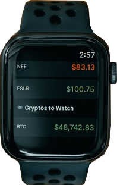

# Next Crypto App

This is a [Next.js](https://nextjs.org/) project bootstrapped with [`create-next-app`](https://github.com/vercel/next.js/tree/canary/packages/create-next-app).
 <!-- PROJECT LOGO -->   
<br />
<p align="center">
  <a href="https://github.com/ChristianPredoianu/next-crypto-app">
    
  </a> 

  <h3 align="center">Crypto app</h3>
  <p align="center">
    <a href="https://github.com/ChristianPredoianu/next-crypto-app"><strong>Explore the docs »</strong></a>
    <br />
    <a href="https://next-crypto-app-eight.vercel.app/">View Demo</a>
    ·
    <a href="https://github.com/ChristianPredoianu/next-crypto-app">Report Bug</a>
  </p>
</p>

 

<!-- TABLE OF CONTENTS -->
<details open="open">
  <summary><h2 style="display: inline-block">Table of Contents</h2></summary>
  <ol>
    <li>
      <a href="#about-the-project">About The Project</a>
      <ul>
        <li><a href="#built-with">Built With</a></li>
      </ul>
    </li>
    <li>
      <a href="#getting-started">Getting Started</a>
      <ul>
        <li><a href="#prerequisites">Prerequisites</a></li>
        <li><a href="#installation">Installation</a></li>
      </ul>
    </li>
    <li><a href="#usage">Usage</a></li>
    <li><a href="#license">License</a></li>
    <li><a href="#contact">Contact</a></li>
    <li><a href="#acknowledgements">Acknowledgements</a></li>
  </ol>
</details>


<!-- ABOUT THE PROJECT -->
## About The Project

A website with information about crypto currencies and data.

### Built With

* [Next.js](https://nextjs.org/)
* [HTML5](https://developer.mozilla.org/en-US/docs/Glossary/HTML5)
* [Tailwind Css](https://tailwindcss.com/)
* [GSAP](https://greensock.com/gsap/)
* [Classnames](https://jedwatson.github.io/classnames/)


<!-- GETTING STARTED -->
## Getting Started

To get a local copy up and running follow these simple steps.

### Prerequisites

* npm
  ```sh
  npm install npm@latest -g
  ```

### Installation

1. Clone the repo
   ```sh
   git clone https://github.com/ChristianPredoianu/next-crypto-app.git
   ```
2. Install NPM packages
   ```sh
   npm install
   ``` 
3. Serve with hot reload at localhost
   ```sh
    npm run dev
   ``` 
5. Build for production 
   ```sh
    npm run build
   
   ```

<!-- USAGE EXAMPLES -->
## Usage


Navigate around the site, toggle dark mode (Not using window.matchMedia to detect system preferance though). 

---/currencyInfo route: User can open tabs to navigate to details about a specific currency.

---/exchange route: See info about top 5 crypto currencies. Navigate a list of currencies with the help of pagination. Filter currency data (ascending, descending) 
and reset the filter. 

Scroll up and down to animate cards (GSAP ScrollTrigger)


<!-- LICENSE -->
## License

Distributed under the MIT License. See `LICENSE` for more information.


<!-- CONTACT -->
## Contact

Christian Predoianu - [@linkedin](https://se.linkedin.com/in/christian-predoianu-369218157) - christianpredoianu@yahoo.com

Project Link: [https://github.com/ChristianPredoianu/next-crypto-app](https://github.com/ChristianPredoianu/next-crypto-app)


<!-- ACKNOWLEDGEMENTS --> 
## Acknowledgements
* [Google Fonts](https://fonts.google.com/)
* [Font-Awesome](https://fontawesome.com/)
* [CoinGecko API](https://www.coingecko.com/en/api)

